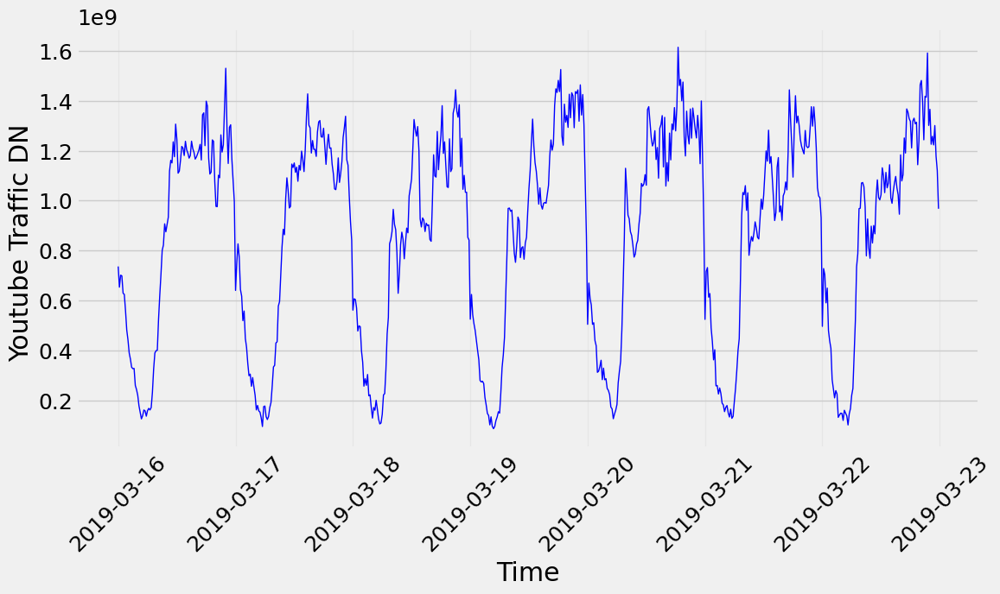
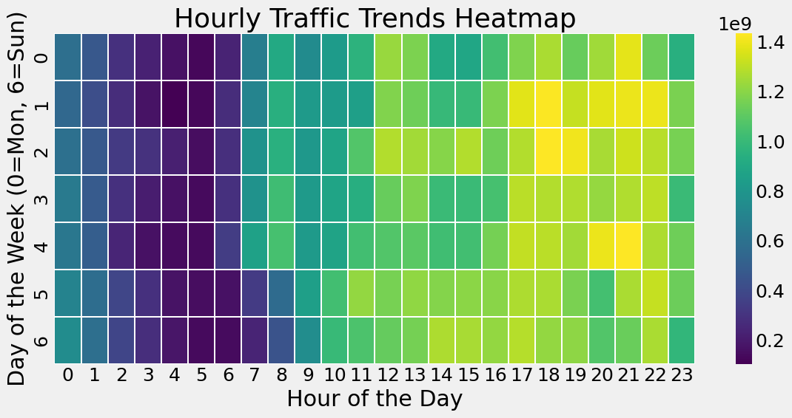
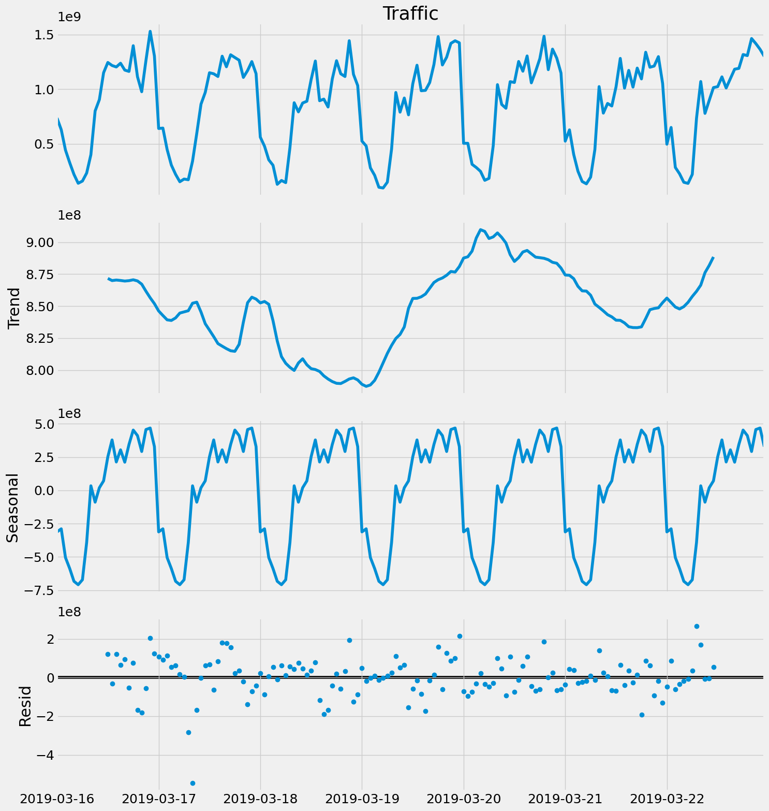
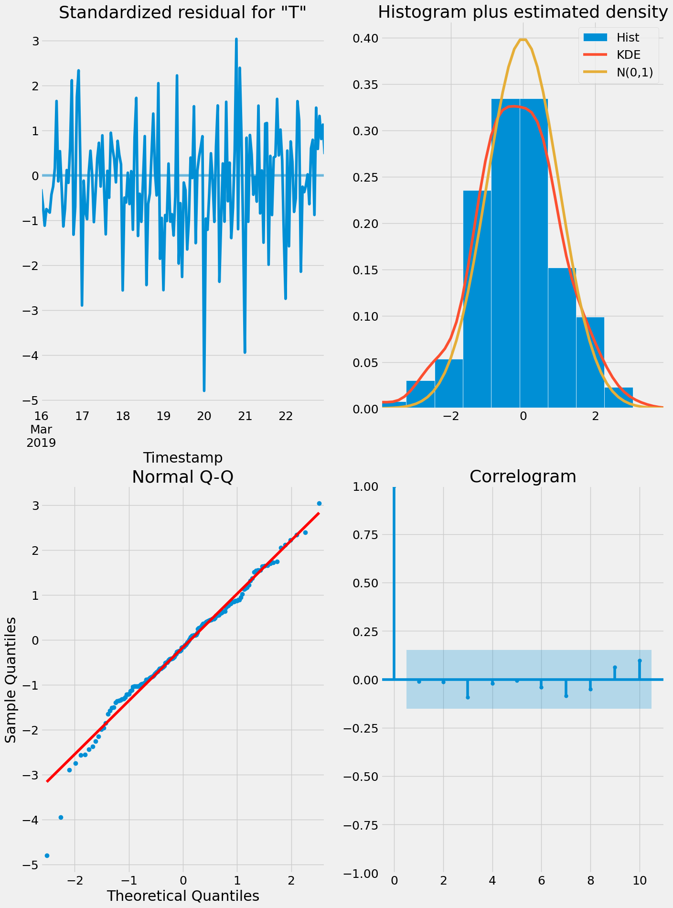
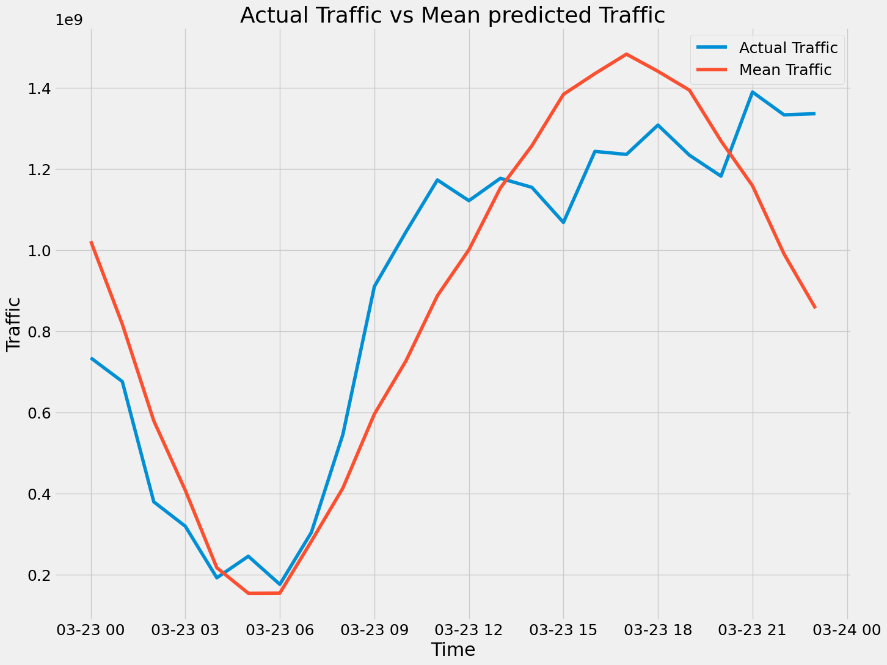
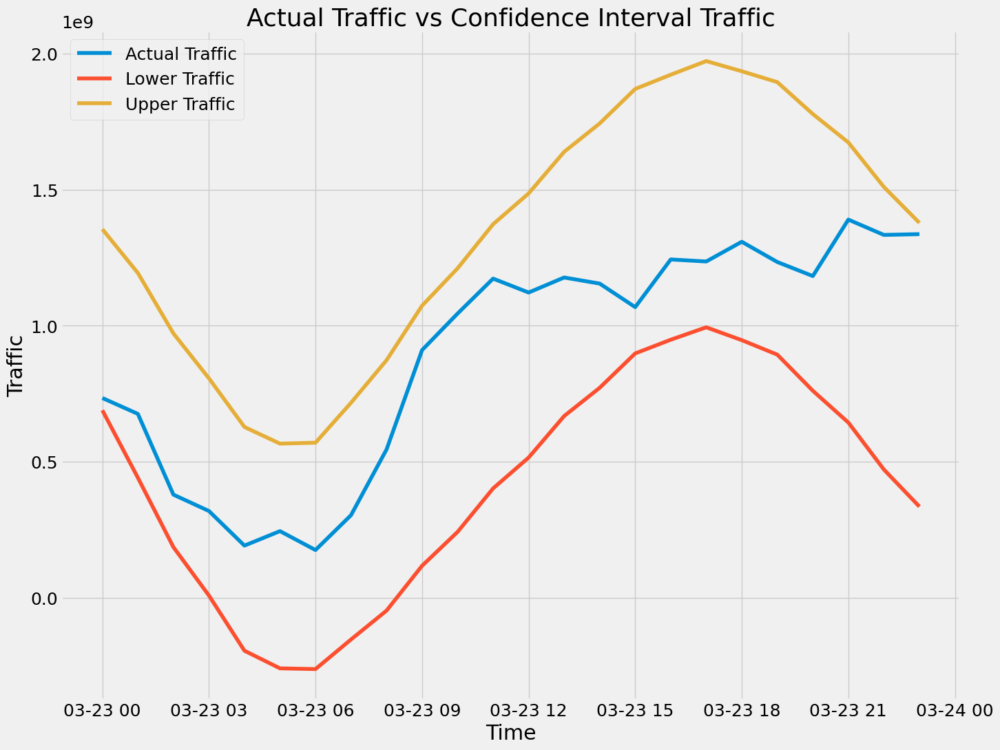

# YouTube DN Traffic Data Analysis and Prediction

## Description

This Jupyter Notebook analyzes YouTube DN traffic data for a specific city over 2 weeks. It preprocesses the data to ensure its quality and formats it for predictive modeling. The notebook's goal is to make ARIMA model to forecast future traffic based on historical data.

## Table of Contents

1. [Constants](#constants)
2. [Data Loading](#data-loading)
3. [Preprocessing](#preprocessing)
   - Avoiding Tiles Outside the City
   - Reformating the DataFrame
   - Handling Zero Traffic
   - Handling NULL Values
   - Handling Outliers
4. [Exploratory Data Analysis (EDA)](#exploratory-data-analysis-eda)
   - Time Series Visualization
   - Decomposing the time series
5. [Modeling](#modeling)
   - ACF and PACF Analysis
   - ARIMA Model
   - Model Diagnostics
6. [Results](#results)
7. [Making Predictions](#making_predictions)
8. [Dependencies](#dependencies)

## Constants

Definition of constants used throughout the notebook.

## Data Loading

Loading YouTube DN traffic data for the following periods:
- 16th to 22nd of March
- 23rd to 29th of March

## Preprocessing

### Avoiding Tiles Outside the City

To ensure the analysis focuses on the city, tiles outside the city are excluded from the dataset.

### Reformating the DataFrame

The data is reformatted to include only the timestamp and the corresponding total traffic. This simplification helps in focusing on the overall traffic trends.

### Handling Zero Traffic

The notebook checks for and addresses times with zero traffic to ensure data integrity.

### Handling NULL Values

The notebook checks for NULL values in the dataset and addresses them to maintain data quality.

### Handling Outliers

Outliers in the dataset are identified and handled appropriately to prevent skewing the analysis.

## Exploratory Data Analysis (EDA)

### Time Series Visualization

Visualizing traffic data across the weeks to understand periodic patterns and clustering:

- Periodic traffic patterns are observed.

- Traffic increases after 5 PM (working hours).
- Different traffic patterns on working days versus holidays.

### Decomposing the time series

Decomposing the time series into three major components: seasonality, trend, and noise.

## Modeling

### ACF and PACF Analysis

Autocorrelation Function (ACF) and Partial Autocorrelation Function (PACF) are used to identify the best parameters for the ARIMA model.

### ARIMA Model

The ARIMA (AutoRegressive Integrated Moving Average) model is used for forecasting:
- ARIMA(p, d, q) model: Parameters are determined based on ACF and PACF analysis.
- Parameters also determined based on AIC and BIC values

### Model Diagnostics

Diagnosing the model to ensure it is performing well. This includes analyzing the residuals:

- Standardized residuals plot
- Histogram plus estimated density plot
- Normal Q-Q plot
- Correlogram

## Results

We evaluate our model using RMS, MAE and r2_score:

| Data  | r2_scoer | RMS          | MAE          |
| ----- | -------- | ------------ | ------------ |
| Train | 0.85     | 162113034.88 | 123526858.92 |
| Test  | 0.82     | 173435537.94 | 137383754.76 |

## Making Predictions

we use get_forecast() method to predict the traffic of the next day "2019-03-23" and we visualize these predictions

- we see that actual traffic always within the confidence interval

## Dependencies

- Python 3.11.4
- Jupyter Notebook
- pandas
- numpy
- matplotlib
- seaborn
- scikit-learn
- statsmodels
